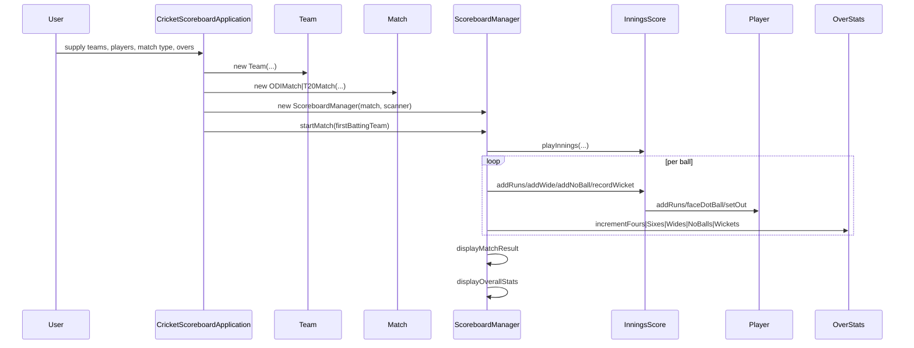

# Cricket Scoreboard — Project Documentation

## Quick Overview

- Purpose: A simple Java console application that simulates a cricket scoreboard for ODI and T20 matches, tracks per-innings and per-player statistics, and prints match results and summaries.
- Run: compile and run `src/main/CricketScoreboardApplication.java`.

## Quick Run (CLI)

```bash
# from repository root
javac -d out $(find src -name "*.java")
java -cp out main.CricketScoreboardApplication
```

## Repository Structure

- `src/main/CricketScoreboardApplication.java` — application entrypoint and user I/O.
- `src/match/` — match abstractions and concrete match types.
  - `Match.java`, `ODIMatch.java`, `T20Match.java`
- `src/team/` — team and player models.
  - `Team.java`, `Player.java`
- `src/scoreboard/` — scoring engine and innings representation.
  - `ScoreboardManager.java`, `InningsScore.java`
- `src/statistics/` — small helpers for per-over stats and display contract.
  - `OverStats.java`, `Statistics.java`
- `src/exception/InvalidBallInputException.java` — validation exception.

See files:

- [src/main/CricketScoreboardApplication.java](src/main/CricketScoreboardApplication.java)
- [src/match/Match.java](src/match/Match.java)
- [src/match/ODIMatch.java](src/match/ODIMatch.java)
- [src/match/T20Match.java](src/match/T20Match.java)
- [src/team/Team.java](src/team/Team.java)
- [src/team/Player.java](src/team/Player.java)
- [src/scoreboard/ScoreboardManager.java](src/scoreboard/ScoreboardManager.java)
- [src/scoreboard/InningsScore.java](src/scoreboard/InningsScore.java)
- [src/statistics/OverStats.java](src/statistics/OverStats.java)
- [src/statistics/Statistics.java](src/statistics/Statistics.java)
- [src/exception/InvalidBallInputException.java](src/exception/InvalidBallInputException.java)

---

## High-level Architecture

- `CricketScoreboardApplication` collects user input (team names, players, match type, overs, batting choice).
- It constructs two `Team` objects and a `Match` (either `ODIMatch` or `T20Match`).
- A `ScoreboardManager` is created with the `Match` and `Scanner` and is responsible for running the match lifecycle via `startMatch()`.
- `ScoreboardManager.startMatch()` runs two innings by calling `playInnings(...)` for each side.
- `InningsScore` stores per-innings state (runs, wickets, balls, which players are striker/non-striker, extras, boundaries).
- `Player` objects hold per-player cumulative stats and are mutated as balls are processed.
- `OverStats` aggregates per-over events and is displayed via methods required by the `Statistics` interface.

---

## Class-by-class Details (A → Z)

**`main.CricketScoreboardApplication`**:

- Purpose: Console UI and wiring.
- Key flow:
  - Reads team names and player arrays via `readPlayers(...)`.
  - Instantiates `Team` objects: `new Team(teamName, playerNames)`.
  - Reads `matchType` and `overs`.
  - Creates `Match` instance:
    - `if matchType == 1` → `new ODIMatch(teamA, teamB, overs)`
    - `else if matchType == 2` → `new T20Match(teamA, teamB, overs)`
    - invalid → throws `InvalidBallInputException`.
  - Asks which team bats first and then constructs `ScoreboardManager(match, scanner)` and calls `startMatch(firstBattingTeam)`.
- After `main` calls `ScoreboardManager.startMatch(...)`: control transfers into the scoring engine which drives innings and per-ball decisions until match end.

**`match.Match` (abstract)**:

- Fields: `teamA`, `teamB`, `oversPerInnings`.
- Constants: `PLAYERS_PER_TEAM=11`, `BALLS_PER_OVER=6`, `MAX_WICKETS=10`.
- Key methods:
  - `validateOvers(int requestedOvers)`: throws `InvalidBallInputException` if overs out of range (1..getMaximumOversAllowed()).
  - `getTeamA()/getTeamB()/getOversPerInnings()` getters.
  - `getMatchType()`, `getMaximumOversAllowed()` are abstract and implemented by concrete classes.
- After `validateOvers(...)` succeeds, construction continues and match instance is used by `ScoreboardManager` for game limits.

**`match.ODIMatch` and `match.T20Match`**:

- Provide concrete `getMatchType()` ("ODI" / "T20") and `getMaximumOversAllowed()` (50 / 20).
- No additional behavior; they primarily control allowable overs via `Match.validateOvers()`.

**`team.Team`**:

- Fields: `name`, `Player[] players` (size `Match.PLAYERS_PER_TEAM`).
- Constructor builds `Player` instances from passed names (fills defaults for missing names).
- `getPlayers()` returns the player array; `getName()` returns the team name.
- `Team` is used by `InningsScore` as `battingTeam`/`bowlingTeam` and by `ScoreboardManager` for selection and final displays.

**`team.Player`**:

- Fields: `name`, `runs`, `ballsFaced`, `fours`, `sixes`, `isOut`.
- Key methods:
  - `addRuns(int runsScored)`: increments `runs`, increments `ballsFaced`, and updates `fours/sixes` counters when appropriate.
  - `faceDotBall()`: increments `ballsFaced` when dot.
  - `setOut(boolean)`: marks player as out.
- After `Player.addRuns(...)` is called by `InningsScore.addRuns(int)`, the `Player` instance holds updated personal stats used later by match summary displays.

**`scoreboard.InningsScore`**:

- Purpose: Mutable state of a single innings.
- Fields: `battingTeam`, `bowlingTeam`, `totalRuns`, `wickets`, `legalBalls`, `wides`, `noBalls`, `fours`, `sixes`, `strikerIndex`, `nonStrikerIndex`, `nextBatsmanIndex`.
- Key methods & effects (what happens and what is called afterwards):
  - `addWide()`:
    - increments `totalRuns` and `wides`.
    - does NOT increment `legalBalls` (since wides are not legal deliveries).
    - Caller (`ScoreboardManager.playInnings`) reacts by updating `OverStats.incrementWides()` and continues the same ball count.
  - `addNoBall()`:
    - increments `totalRuns` and `noBalls`.
    - Caller updates `OverStats.incrementNoBalls()` and often sets `freeHit` in `ScoreboardManager`.
  - `addRuns(int runs)`:
    - retrieves current `Player` via `getStriker()` and calls `striker.addRuns(runs)` (player state mutated: runs, balls faced, fours/sixes).
    - increments `totalRuns` and increments `legalBalls`.
    - increments `fours` or `sixes` counters in `InningsScore` when appropriate.
    - Caller (`ScoreboardManager`) updates `OverStats.incrementFours()` or `incrementSixes()` and may rotate strike based on runs.
  - `recordWicket()` (or equivalent; wicket handling present in play logic):
    - marks striker `setOut(true)`, increments `wickets`, advances `nextBatsmanIndex` to set a new striker.
    - Caller updates `OverStats.incrementWickets()`.
  - `isAllOut()` and `getLegalBalls()/getTotalRuns()` used by `ScoreboardManager` loop conditions.

**`scoreboard.ScoreboardManager`**:

- Implements `statistics.Statistics` and acts as main engine.
- Fields: `match`, `scanner` and local `VALID_RUNS` set.
- Key public method: `startMatch(Team firstBattingTeam)`:
  - Determines batting order using `match.getTeamA()` / `match.getTeamB()`.
  - Calls `playInnings(team1, team2, -1)` to play first innings.
  - Computes `target = firstInningsTotal + 1` and prints.
  - Calls `playInnings(team2, team1, target)` to play second innings (target-aware).
  - Calls `displayMatchResult(inn1, inn2)` to print winner and summary.
  - Calls `displayOverallStats(inn1, inn2)` and `askTeamForPlayerScores(...)` for any final per-player reporting.
- Key private method: `playInnings(Team bat, Team bowl, int target)` — main ball-by-ball loop:
  - Creates `InningsScore inn = new InningsScore(bat, bowl)` and `OverStats overStats = new OverStats()`.
  - `limitBalls = match.getOversPerInnings() * Match.BALLS_PER_OVER`.
  - While `inn.getLegalBalls() < limitBalls && !inn.isAllOut()` and (if target>0) `inn.getTotalRuns() < target`:
    - Read run input (or ball command) from `scanner`.
    - Validate input: if wides/no-balls, call `inn.addWide()` or `inn.addNoBall()` and `overStats.incrementWides()`/`incrementNoBalls()`.
    - For legal ball with runs:
      - If run is in `VALID_RUNS` (0,1,2,3,4,6) call `inn.addRuns(run)` which calls `Player.addRuns(run)`.
      - If run==0 call `currentPlayer.faceDotBall()`.
      - For boundary/sixes, `overStats.incrementFours()`/`incrementSixes()`.
      - If wicket happens (input indicates), call `recordWicket()` logic: `player.setOut(true)`, `inn.incrementWickets()`, `overStats.incrementWickets()`, and update striker selection.
    - After each legal ball, `inn.legalBalls` increments; `ScoreboardManager` may check over completion (`balls % 6 == 0`) to:
      - call `displayOverStats(overStats, overNumber)` and reset `overStats` for next over.
      - swap striker and non-striker indices at over end.
  - At innings end, `playInnings` returns the `InningsScore` instance to `startMatch()`.
- After `playInnings` returns: `ScoreboardManager` calls `displayFinalStats(...)` / `displayOverStats(...)` per the `Statistics` contract to print summaries.

**`statistics.OverStats`**:

- Aggregates counters for the currently tracked over: `fours`, `sixes`, `wides`, `noBalls`, `wickets`.
- Mutated by `ScoreboardManager` when events occur; later passed to `displayOverStats` to print a per-over summary.

**`statistics.Statistics` (interface)**:

- Methods:
  - `displayOverStats(OverStats overStats, int overNumber)` — print per-over summary.
  - `displayFinalStats(InningsScore inningsScore)` — print innings summary.
  - `calculateRunRate(int runs, int balls)` — compute run-rate double.
- `ScoreboardManager` implements these methods and uses them to emit console output.

**`exception.InvalidBallInputException`**:

- Thrown by `Match.validateOvers()` when user-provided overs are out of range.
- Also used by `Match` constructors to signal invalid configuration back to `main` which prints or aborts.

---

## Detailed Call Flow (typical run)

1. `main()`
   - reads inputs, builds `Team` and `Match` (`ODIMatch`/`T20Match`).
   - constructs `ScoreboardManager(match, scanner)`.
   - calls `scoreboardManager.startMatch(firstBattingTeam)`.

2. `ScoreboardManager.startMatch(firstBattingTeam)`
   - calls `playInnings(team1, team2, -1)`.

3. `ScoreboardManager.playInnings(bat, bowl, target)` — inner loop per ball:
   - instantiate `InningsScore` and `OverStats`.
   - loop while balls remain and innings not all-out and (target not reached for chasing team):
     - read next ball input from `scanner` (e.g., run value, "W" for wicket, "Wd", "Nb").
     - if `Wd` → `inn.addWide()`; `overStats.incrementWides()`; (no legal ball increment).
     - if `Nb` → `inn.addNoBall()`; `overStats.incrementNoBalls()`; set `freeHit=true`.
     - if legal delivery & run appears (0/1/2/3/4/6):
       - `inn.addRuns(runs)` → inside this:
         - calls `Player striker = inn.getStriker()`
         - `striker.addRuns(runs)` → `Player` updates `runs`, `ballsFaced`, `fours/sixes` counters.
         - `inn.totalRuns += runs; inn.legalBalls++;` and update `inn.fours`/`inn.sixes` counters.
       - `ScoreboardManager` updates `OverStats.incrementFours()` / `incrementSixes()` if needed.
       - rotate striker on odd runs or at over-end.
     - if wicket:
       - `player.setOut(true)`; `inn.wickets++`; `overStats.incrementWickets()`; `inn.nextBatsmanIndex++` and set new striker/non-striker accordingly.
     - after each legal ball: if over completed (6 legal balls), `displayOverStats(overStats, overNumber)` is called and `OverStats` reset.
   - return `InningsScore`.

4. Back in `startMatch`: compute `target` and play second innings with `playInnings(team2, team1, target)`.

5. After both innings: `displayMatchResult(inn1, inn2)`, `displayOverallStats(inn1, inn2)`, and `askTeamForPlayerScores(...)`.

---

## Example: What happens on a `4` ball during an innings

- `ScoreboardManager` reads input `4`.
- It calls `inn.addRuns(4)`.
  - `inn.getStriker()` returns the `Player` object at `strikerIndex`.
  - `player.addRuns(4)` updates that player's `runs`, `ballsFaced`, and `fours` count.
  - `inn.totalRuns` increases by 4 and `inn.legalBalls` increments by 1.
  - `inn.fours` increments.
- `ScoreboardManager` observes this and calls `overStats.incrementFours()`.
- If `inn.legalBalls % Match.BALLS_PER_OVER == 0`, it also triggers `displayOverStats(overStats, overNumber)` and swaps striker/non-striker.

## Example: What happens on a `Wd` (wide)

- `ScoreboardManager` sees `Wd` input and calls `inn.addWide()`.
  - `inn.totalRuns++`, `inn.wides++`.
- `ScoreboardManager` calls `overStats.incrementWides()`.
- No `legalBalls` increment; ball remains to be bowled.

## State mutations summary (who mutates what)

- `ScoreboardManager`: owns the match flow, reads input, mutates `OverStats`, calls methods on `InningsScore` and `Player`.
- `InningsScore`: stores innings totals and indices; methods mutate `totalRuns`, `legalBalls`, `wickets`, extra counters and manage striker indices.
- `Player`: mutated by `InningsScore` (via `Player.addRuns(...)`, `faceDotBall()`, `setOut(...)`).
- `OverStats`: mutated by `ScoreboardManager` in response to events, then passed to display methods.

---

## Important Validation & Errors

- `Match.validateOvers()` ensures requested overs are 1..`getMaximumOversAllowed()` for the match type.
- `InvalidBallInputException` propagates construction-time errors back to `main` where the program prints the error and exits.
- Run input is validated against the `VALID_RUNS` set `{0,1,2,3,4,6}` and special tokens for wides/no-balls/wickets; invalid ball inputs should be handled by re-prompting or throwing (based on current `ScoreboardManager` implementation).

---

## Tips for Extension / Testing

- Add unit tests for `InningsScore` to verify `addRuns`, `addWide`, `addNoBall`, wicket logic and striker rotations.
- Add a non-interactive input mode (feed a file or command list) to enable automated scenario testing.
- Add JSON or CSV export of final player stats to integrate with a front-end.

---

## Diagrams

Mermaid sequence for main match flow:



---

## Final Notes

- The code is structured for an interactive console experience; core logic is centralized in `ScoreboardManager` and `InningsScore`.
- Use the file links above to inspect implementations and line-level behavior.

If you want, I can:

- generate a call graph diagram with exact method-level links,
- add unit tests for `InningsScore` and `Player`, or
- convert the engine to a non-interactive driver that consumes scripted events for automated testing.
